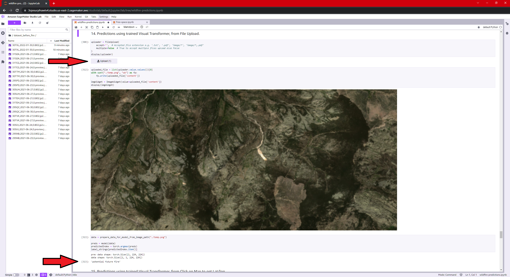
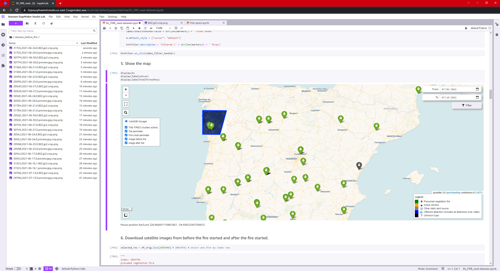
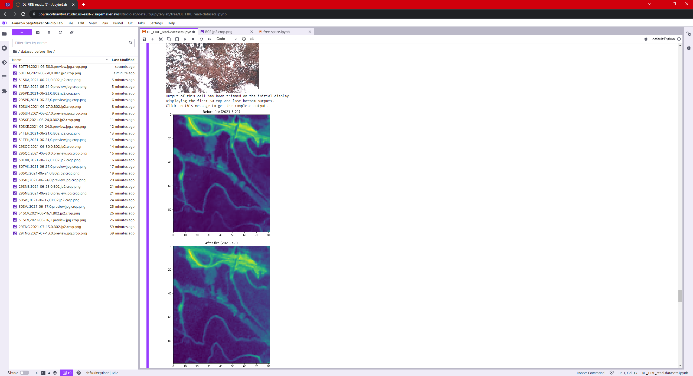
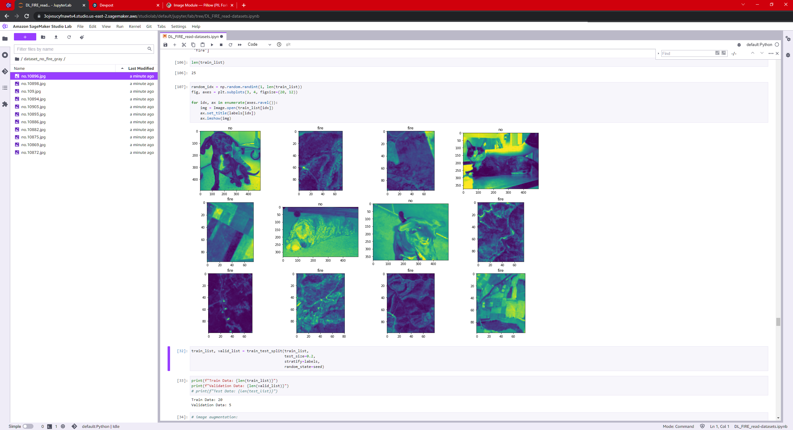

# Wildfire predictions 🔥🌳🛰️🪄

## Predict future wildfires. This novel tool finds past wildfires, crops pre-fire satellite images, and then creates an image dataset of locations that will be burned after the image is taken.

## This dataset is then used to train a neural network. This neural network will try to classify satellite images between "potential future fire location" and "no future fire location".

## The objective is to be ready for the response to disasters, thanks to the fact that the most potentially fire-prone places will be known in advance.

